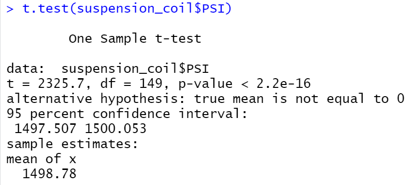

# MechaCar_Statistical_Analysis

## Linear Regression to Predict MPG

With a low p-value of 5.35e-11, the null hypothesis can be rejected, which means that at least one of the independent variables has significant impact on the dependent variable (mpg).

In particular, the p-value of vehicle length and ground clearance are 2.60e-12 and 5.21e-08 respectively, which indicates that they provide non-random amount of variance to the mpg values in the data set. In other words, they have significant impact on mpg. Since the null hypothesis that the independent variables do not impact the dependent variable, the slope is not considered to be zero. Since the p-value of the intercept is significant, the significant features in this model (vehicle length and ground clearance) may need scaling or transforming to help improve the predictive power of the model. There could be other variables that can help explain the variability of mpg that have not been included in the model. Therefore, this linear model does not predict mpg of MechaCar prototypes effectively.

## Summary Statistics on Suspension Coils

After summarizing the suspension coil's PSI metrics, it has a mean of 1498.78, median of 1500, variance of 62.29356, and standard deviation of 7.892627.

When the summarize() function is performed after grouping the PSI column by manufacturing lots using group_by(), the lot summary dataframe is as follows:

As the design specifications for the MechaCar suspension coils dictate that the variance of the suspension coils must not exceed 100 pounds per square inch, our total summary indicate that the suspension coils variance is 62.29, which meets the specification. However, when grouped by manufacturing lot, it is obvious that Lot3 does not meet the specification with a variance of 170.2861224.

## T-Tests on Suspension Coils

A T-Test is performed on suspension coils to determine if the PSI for the manufacturing lots is statistically different from the population mean of 1500 pounds per square inch.

This one sample t-test shows a mean of 1498.78 with a p-value of 2.2e-16, which indicates that null hypothesis is rejected, and that it is statistically different from the population mean.

The 3 one sample t-tests shows that each lot has the same p-value of 2.2e-16, which means that the null hypothesis is rejected, and they are all statistically different from the population mean of 1500 pounds per square.

## Study Design: MechaCar vs Competition

A test can be designed to investigate how MechaCar's city, highway fuel efficiency and safety rating perform against the competition.

Metrics: MechaCar's city fuel efficiency against competition.

Null hypotheses: All vehicles with the same class from different manufacturers have the same mean of city fuel efficiency.

Alternative: The mean of city fuel efficiency is different for at least one of the manufacturers where the vehicles are from the same class.

ANOVA Test to test the statistical difference between the means of city fuel efficiency of other manufacturers/class.

Filter the data where class is appropriate. (If MechaCar is compact, then filter the dataset where class = "compact" for other manufacturers with filter() function)

Then, the ANOVA test may be performed.

Data needed: MechaCar's and other manufacturer's city fuel efficiency of appropriate class.

A boxplot can be created to help visualize the data where x-axis is the class, and y-axis is the city fuel efficiency.

A highway fuel efficiency vs class ANOVA test can be performed by using highway fuel efficiency data instead of city fuel efficiency data. This test investigates whether the mean of highway fuel efficiency for all manufacturers of appropriate class is the same or not.

A safety rating vs class ANOVA test can be performed by using safety rating data instead of city fuel efficiency data. This test investigates whether the mean of safety rating for all manufacturers of appropriate class is the same or not.
